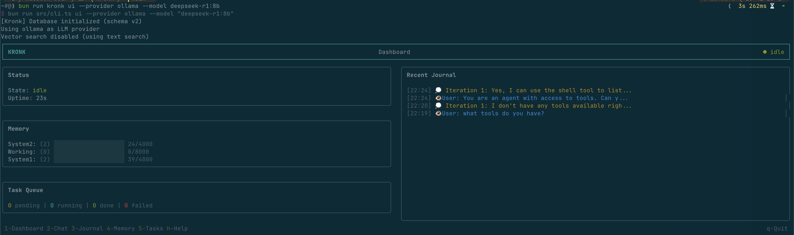
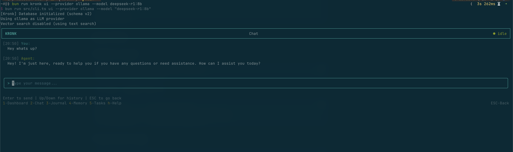

# Kronk


**An agentic AI framework with tiered memory, tool integration, and autonomous task processing**

Kronk provides a foundation for building autonomous AI agents with persistent memory, self-reflection, background task processing, and a rich interactive TUI. Built on TursoDB (libSQL) with optional vector search support.

## Features

- **Tiered Memory System** -- Three cognitive layers (System 2 / Working / System 1) with automatic decay, summarization, and optional vector search
- **Tool Framework** -- Register, discover, and invoke tools with JSON Schema validation; create tools dynamically at runtime (shell, HTTP, JavaScript handlers)
- **Journal & Reflection** -- Chronological logging of thoughts, actions, observations, and decisions with self-reflection
- **Daemon with IPC** -- Background daemon process with JSON-RPC 2.0 over Unix sockets
- **WebSocket Server** -- Browser/remote client interface sharing the same JSON-RPC protocol
- **Interactive TUI** -- React/Ink dashboard with chat, memory, journal, and task views
- **Task Queue** -- Priority-based background task processing with retry and exponential backoff
- **Cron Scheduler** -- Automatic memory decay, cleanup, consolidation, and proactive thinking
- **File Watchers** -- Chokidar-based directory monitoring that triggers runs, memory stores, or queue tasks
- **Multi-Provider LLM** -- Ollama, OpenAI, and Anthropic out of the box
- **Skills System** -- Markdown skill documents loaded from `.kronk/skills/`
- **Local-First** -- All state persists in a `.kronk/` folder with SQLite; optional Turso cloud sync

## Screenshots




## Installation

### One-Line Install

```bash
curl -fsSL https://raw.githubusercontent.com/csepant/kronk/main/install.sh | bash
```

This will install Node.js (if needed), install kronk-ai globally via npm, and launch the interactive setup wizard.

```bash
# Options
bash install.sh --dry-run    # Preview without making changes
bash install.sh --no-init    # Skip the setup wizard
bash install.sh --verbose    # Debug output
```

### Manual Install

```bash
# Using npm
npm install -g kronk-ai

# Using bun
bun add -g kronk-ai

# As a project dependency
npm install kronk-ai
```

## Quick Start

### Initialize an Agent

```bash
# Interactive wizard (recommended)
kronk init

# Non-interactive with flags
kronk init --name "my-agent" --provider anthropic --model claude-sonnet-4-20250514

# Enable vector search (requires an embedding model)
kronk init --name "my-agent" --provider openai --vector-search

# Disable interactive wizard explicitly
kronk init --no-interactive
```

This creates a `.kronk/` folder:

```
.kronk/
├── kronk.db          # TursoDB/libSQL database
├── config.json       # Runtime configuration
├── constitution.md   # Agent identity and principles
├── skills/           # Skill docs (git.md, shell.md, etc.)
├── kronk.sock        # Unix socket for daemon IPC (runtime)
└── kronk.pid         # Daemon PID file (runtime)
```

### Programmatic Usage

```typescript
import { init, load, Agent, OllamaLLM } from 'kronk-ai';

// Initialize a new agent (or use load() for an existing one)
const instance = await init(undefined, {
  config: { name: 'my-agent', provider: 'ollama' }
});

// Create LLM and (optionally) an embedder
const llm = new OllamaLLM({ model: 'llama3.2' });

// Create and initialize the agent
const agent = new Agent(instance, { llm });
await agent.initialize();

// Run the agent
const result = await agent.run('Help me plan a software project');
console.log(result.response);
```

## Memory System

### Memory Tiers

| Tier | Purpose | Max Tokens | Decay Rate |
|------|---------|------------|------------|
| `system2` | Strategic, long-term knowledge | 30,000 | 0.01 (slow) |
| `working` | Current tasks and active context | 100,000 | 0.1 (moderate) |
| `system1` | Recent interactions and immediate context | 20,000 | 0.5 (fast) |

Tiers auto-summarize when they reach 80-90% capacity using an LLM-powered summarizer. Vector search is optional and controlled by the `useVectorSearch` config flag; when disabled, Kronk falls back to text-based search.

### Working with Memory

```typescript
// Store a memory
await instance.memory.store({
  tier: 'working',
  content: 'The user prefers TypeScript over JavaScript',
  importance: 0.8,
  source: 'inference',
  tags: ['preference', 'language'],
});

// Semantic search (vector) or text search (fallback)
const results = await instance.memory.search('programming language preferences', {
  limit: 5,
  minSimilarity: 0.6,
});

// Build context window for LLM
const context = await instance.memory.buildContextWindow();
const prompt = instance.memory.formatContextForPrompt(context);

// Promote important memories between tiers
await instance.memory.promote(memoryId); // system1 -> working -> system2

// Maintenance (also handled automatically by the scheduler)
await instance.memory.applyDecay();
await instance.memory.cleanup();
```

## Tools

```typescript
// Register a tool
await instance.tools.register({
  name: 'web_search',
  description: 'Search the web for information',
  schema: {
    type: 'object',
    properties: {
      query: { type: 'string', description: 'Search query' },
      limit: { type: 'number', description: 'Max results', default: 10 },
    },
    required: ['query'],
  },
  handler: 'runtime:web_search',
});

// Register runtime handler
instance.tools.registerHandler('web_search', async (params) => {
  const { query, limit } = params;
  // Implement search logic
  return { results: [...] };
});

// Invoke a tool
const result = await instance.tools.invoke('web_search', { query: 'TursoDB' });
```

The agent also registers 8 built-in tools on `initialize()`: `shell`, `create_task`, `create_tool`, `discover_tools`, `discover_skills`, `read_skill`, `journal`, and `notify`.

## Journal

```typescript
// Start a session
const sessionId = await instance.journal.startSession({
  goal: 'Build a REST API',
});

// Log entries
await instance.journal.thought('Considering Express vs Fastify');
await instance.journal.decision('Choosing Fastify for performance', 0.85);
await instance.journal.action(
  'Created project scaffold',
  toolId,
  '{"template": "fastify"}',
  '{"success": true}',
  1234 // duration ms
);
await instance.journal.milestone('MVP API completed');

// Search journal
const entries = await instance.journal.search('API design decisions');

// End session
await instance.journal.endSession('completed');
```

## CLI Commands

### Core

```bash
kronk init --name my-agent --provider anthropic --model claude-sonnet-4-20250514
kronk init --vector-search          # Enable vector search
kronk status                        # Agent status and stats
kronk status --live                 # Live updating (requires daemon)
```

### Daemon

```bash
kronk start                         # Start background daemon
kronk start --ws-port 3000          # With WebSocket server
kronk start --ws-port 3000 --ws-host 0.0.0.0 --ws-origins "http://localhost:5173"
kronk stop                          # Stop the daemon
kronk restart                       # Restart the daemon
```

### Interactive

```bash
kronk ui                            # Launch TUI dashboard
kronk ui --allow-shell              # Auto-approve shell commands
kronk chat                          # Simple REPL chat mode
kronk chat --provider openai        # Override provider for session
```

### Data

```bash
kronk memory list --tier working --limit 10
kronk memory add "Important fact" --tier system2 --importance 0.9
kronk memory stats

kronk journal list --type decision --limit 20
kronk logs                          # Stream journal entries
kronk logs --follow                 # Follow new entries (requires daemon)

kronk tools list
```

### Task Queue

```bash
kronk queue list --status pending
kronk queue add <type> --priority 5 --data '{"key":"value"}'
kronk queue cancel <id>
```

### File Watchers

```bash
kronk watch add "src/**/*.ts" --action memory --debounce 500
kronk watch list
kronk watch remove <id>
```

### Configuration

```bash
kronk constitution                  # View agent constitution
kronk config                        # View current config
kronk config --set debug=true       # Update a config value
```

## Daemon & WebSocket

Kronk runs as a background daemon with JSON-RPC 2.0 IPC over Unix sockets:

```bash
kronk start
```

The daemon integrates the Agent, Scheduler, QueueManager, IPC server, and optional WebSocket server into a single long-running process.

### WebSocket Interface

Enable a WebSocket server for browser or remote clients:

```bash
kronk start --ws-port 3000 --ws-origins "http://localhost:5173"
```

The WebSocket server uses the same JSON-RPC 2.0 protocol as Unix socket IPC, plus additional methods:

- `shell.confirm.respond` -- Interactive shell approval from remote clients
- `agent.thinking.start` / `agent.thinking.chunk` / `agent.thinking.complete` -- Streaming thinking events

Origin validation is controlled via the `--ws-origins` flag.

## LLM Providers

Configure via environment variables or CLI flags:

### Ollama (default)

```bash
export OLLAMA_HOST=http://localhost:11434
export OLLAMA_MODEL=llama3.2
kronk init --provider ollama
```

### OpenAI

```bash
export OPENAI_API_KEY=sk-...
kronk init --provider openai --model gpt-4o
```

### Anthropic

```bash
export ANTHROPIC_API_KEY=sk-ant-...
kronk init --provider anthropic --model claude-sonnet-4-20250514
```

Provider priority: `LLM_PROVIDER` env var > config file > auto-detect.

## Embedding Providers

Embeddings are optional. Enable with `--vector-search` during init. Supported providers:

```typescript
import { OpenAIEmbedder, VoyageEmbedder, OllamaEmbedder, MockEmbedder } from 'kronk-ai';

// OpenAI
const embedder = new OpenAIEmbedder({
  apiKey: process.env.OPENAI_API_KEY,
  model: 'text-embedding-3-small',
});

// Voyage AI
const embedder = new VoyageEmbedder({
  apiKey: process.env.VOYAGE_API_KEY,
  model: 'voyage-2',
});

// Local Ollama
const embedder = new OllamaEmbedder({
  model: 'nomic-embed-text',
  baseUrl: 'http://localhost:11434',
});
```

## Environment Variables

| Variable | Description |
|----------|-------------|
| `LLM_PROVIDER` | `ollama`, `openai`, or `anthropic` |
| `ANTHROPIC_API_KEY` | Anthropic API key |
| `OPENAI_API_KEY` | OpenAI API key |
| `OLLAMA_HOST` | Ollama server URL (default: `http://localhost:11434`) |
| `OLLAMA_MODEL` | Ollama LLM model (default: `llama3.2`) |
| `OLLAMA_EMBED_MODEL` | Ollama embedding model (default: `nomic-embed-text`) |

## Architecture

```
┌──────────────────────────────────────────────────────────────────┐
│                           Daemon                                 │
│  ┌──────────┐  ┌───────────┐  ┌────────────┐  ┌─────────────┐  │
│  │IPC Server│  │ WS Server │  │ Scheduler  │  │Queue Manager│  │
│  └─────┬────┘  └─────┬─────┘  └──────┬─────┘  └──────┬──────┘  │
│        └──────┬──────┘               │               │          │
│               ▼                      ▼               ▼          │
│  ┌──────────────────────────────────────────────────────────┐   │
│  │                         Agent                             │   │
│  │  ┌─────────────────────────────────────────────────────┐  │   │
│  │  │                    LLM Provider                      │  │   │
│  │  └─────────────────────────────────────────────────────┘  │   │
│  │                           │                                │   │
│  │  ┌────────┐ ┌────────┐ ┌────────┐ ┌─────────┐ ┌────────┐ │   │
│  │  │Memory  │ │ Tools  │ │Journal │ │Messages │ │Embedder│ │   │
│  │  │Manager │ │Manager │ │Manager │ │Manager  │ │(opt.)  │ │   │
│  │  └───┬────┘ └───┬────┘ └───┬────┘ └────┬────┘ └───┬────┘ │   │
│  │      └──────┬───┴─────┬────┘           │          │      │   │
│  └─────────────┼─────────┼────────────────┼──────────┘──────┘   │
│                ▼         ▼                ▼                      │
│  ┌──────────────────────────────────────────────────────────┐   │
│  │                   TursoDB (libSQL)                         │   │
│  │  memory │ tools │ journal │ sessions │ messages │ queue    │   │
│  └──────────────────────────────────────────────────────────┘   │
│                                                                  │
│  ┌─────────────┐                                                │
│  │File Watcher │                                                │
│  └─────────────┘                                                │
└──────────────────────────────────────────────────────────────────┘
```

## License

MIT

## Contributing

Contributions welcome! Please read CONTRIBUTING.md before submitting PRs.
